# 推荐系统学习笔记｜OneTrans 主线

来源：https://www.xiaohongshu.com/explore/69eb72010000000020039fdd?xsec_token=ABzKBwRo3EkyRDb21gA1E4c6p0iygFS7dm3guLP2lTXLw=&xsec_source=pc_user&source=web_profile_page

作者：无敌嘉然大王

发布时间：2026-04-24 21:37:05

地点：江苏

标签：大模型、算法、搜广推

互动数据：点赞 123，收藏 134，评论 13，分享 28

## 笔记正文

明天正式开始腾讯的广告算法比赛了，今天看了一下onetrans的论文：OneTrans: Unified Feature Interaction and Sequence Modeling with One Transformer in Industrial Recommender。

OneTrans 的核心思路是：把用户历史行为、候选 item、用户特征、上下文特征都转成 token，再用一个统一 Transformer Backbone 同时做序列建模和特征交互。相比传统“先编码历史、再做特征交互”的两段式推荐模型，OneTrans 更强调统一建模、长序列利用和系统效率优化。

#大模型 #算法 #搜广推

（小红书只允许上传18张图片，所以我中间的工程优化、消融实验的省略掉了）

## 图片 01 转录

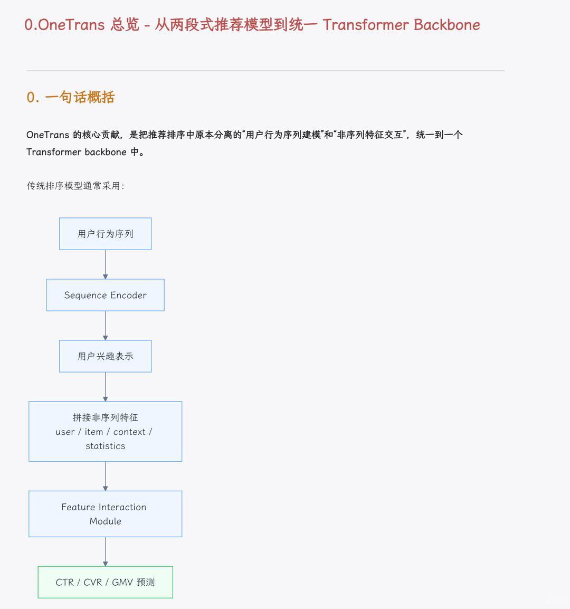

### 0.OneTrans 总览 - 从两段式推荐模型到统一 Transformer Backbone

#### 0. 一句话概括

OneTrans 的核心贡献，是把推荐排序中原本分离的“用户行为序列建模”和“非序列特征交互”，统一到一个 Transformer backbone 中。

传统排序模型通常采用：

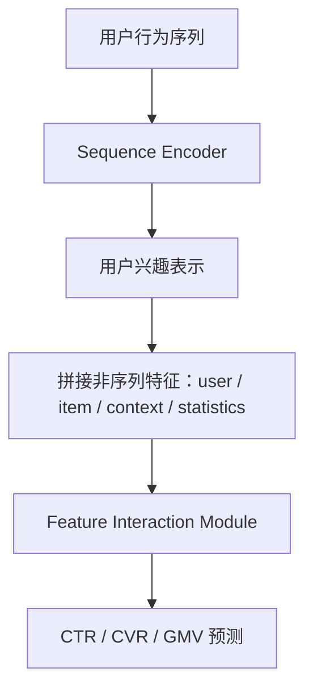
```mermaid
flowchart TD
  A["用户行为序列"] --> B["Sequence Encoder"]
  B --> C["用户兴趣表示"]
  C --> D["拼接非序列特征：user / item / context / statistics"]
  D --> E["Feature Interaction Module"]
  E --> F["CTR / CVR / GMV 预测"]
```

## 图片 02 转录

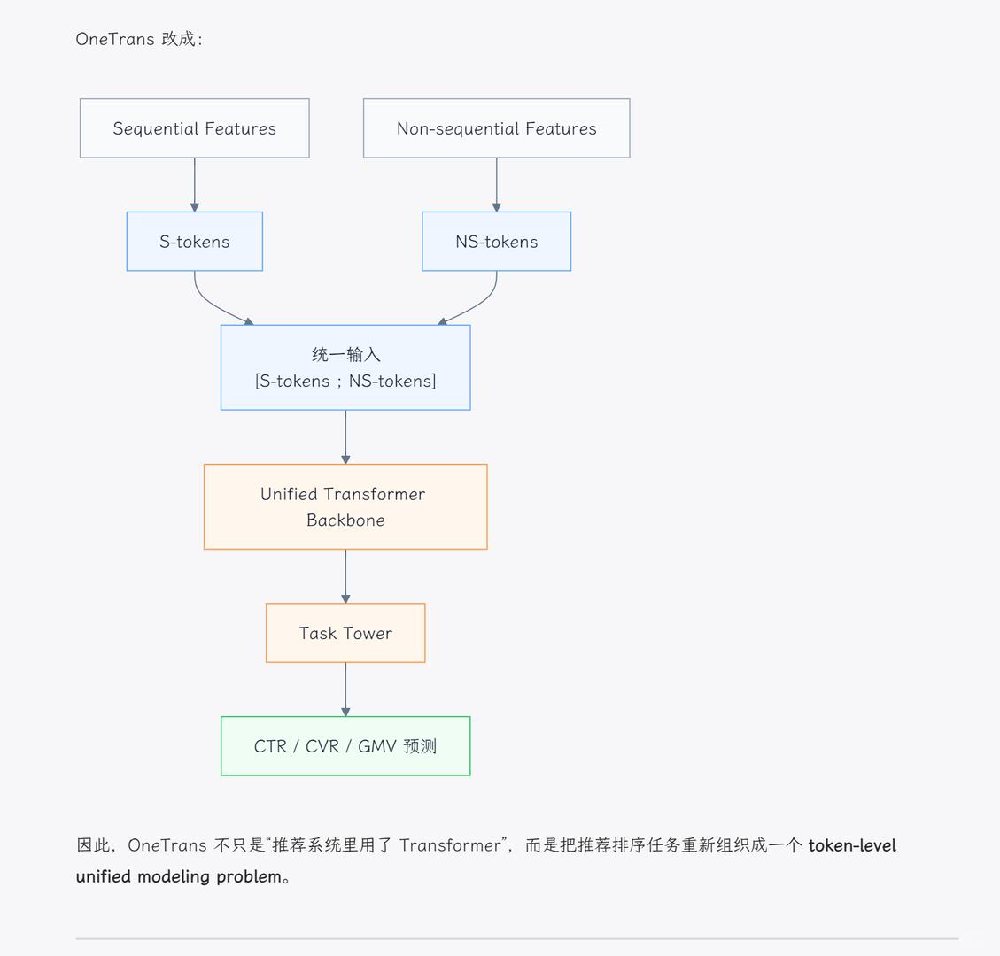

OneTrans 改成：

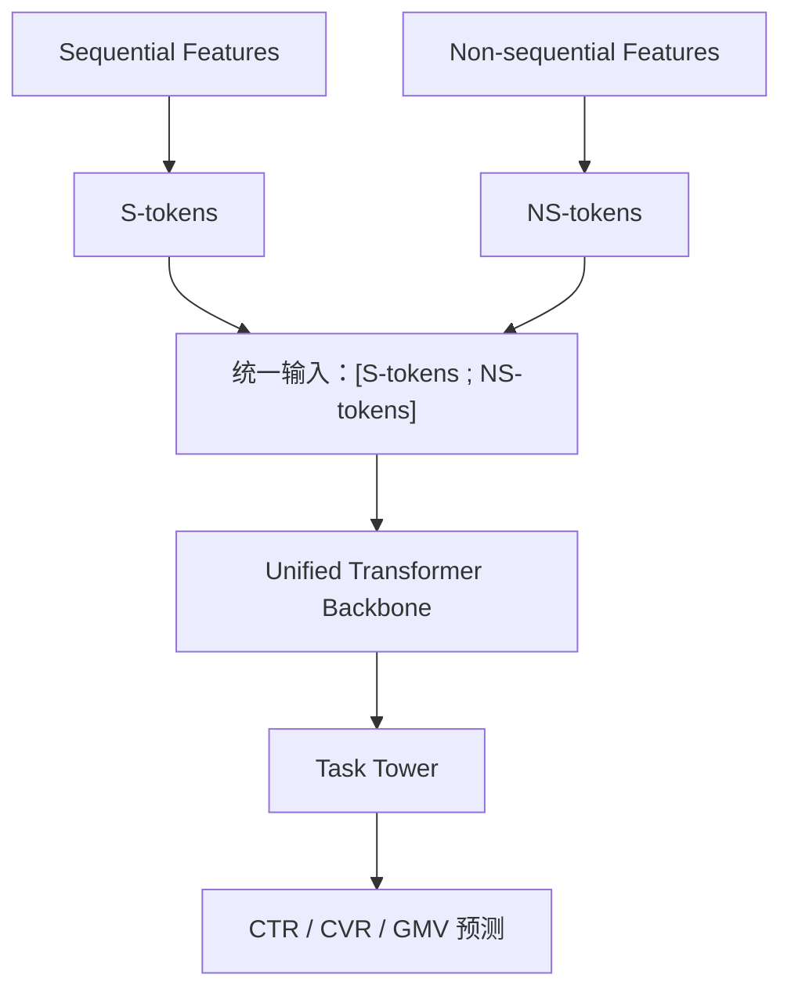
```mermaid
flowchart TD
  A["Sequential Features"] --> B["S-tokens"]
  C["Non-sequential Features"] --> D["NS-tokens"]
  B --> E["统一输入：[S-tokens ; NS-tokens]"]
  D --> E
  E --> F["Unified Transformer Backbone"]
  F --> G["Task Tower"]
  G --> H["CTR / CVR / GMV 预测"]
```

因此，OneTrans 不只是“推荐系统里用了 Transformer”，而是把推荐排序任务重新组织成一个 token-level unified modeling problem。

## 图片 03 转录

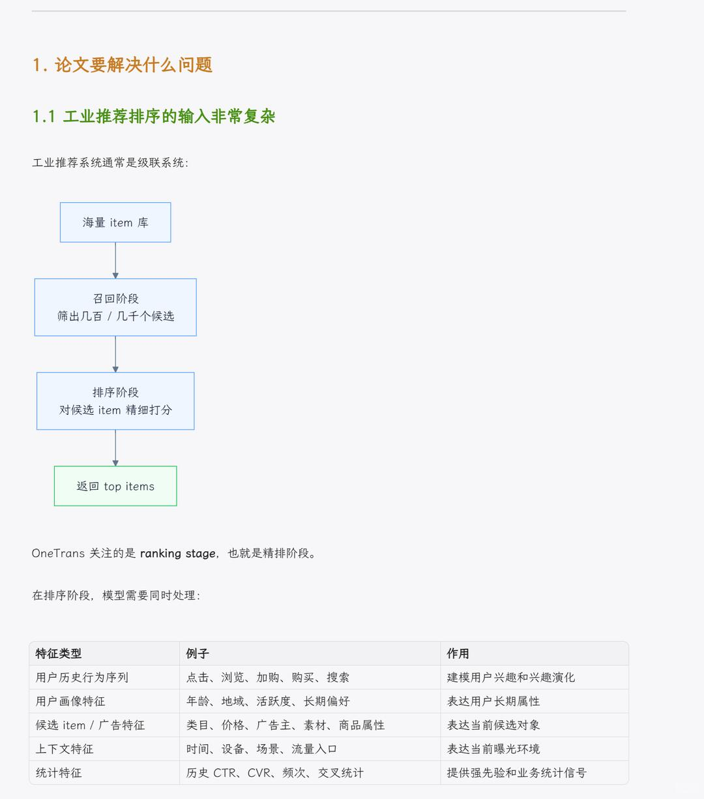

### 1. 论文要解决什么问题

#### 1.1 工业推荐排序的输入非常复杂

工业推荐系统通常是级联系统：

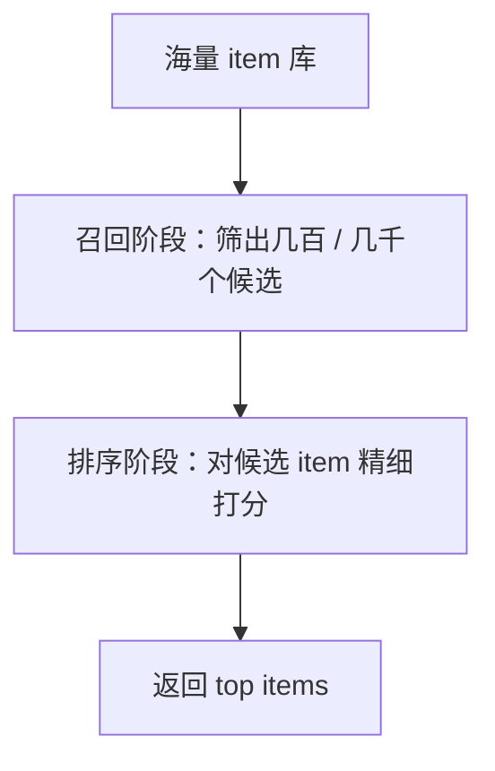
```mermaid
flowchart TD
  A["海量 item 库"] --> B["召回阶段：筛出几百 / 几千个候选"]
  B --> C["排序阶段：对候选 item 精细打分"]
  C --> D["返回 top items"]
```

OneTrans 关注的是 ranking stage，也就是精排阶段。

在排序阶段，模型需要同时处理：

| 特征类型 | 例子 | 作用 |
| --- | --- | --- |
| 用户历史行为序列 | 点击、浏览、加购、购买、搜索 | 建模用户兴趣和兴趣演化 |
| 用户画像特征 | 年龄、地域、活跃度、长期偏好 | 表达用户长期属性 |
| 候选 item / 广告特征 | 类目、价格、广告主、素材、商品属性 | 表达当前候选对象 |
| 上下文特征 | 时间、设备、场景、流量入口 | 表达当前曝光环境 |
| 统计特征 | 历史 CTR、CVR、频次、交叉统计 | 提供强先验和业务统计信号 |

## 图片 04 转录

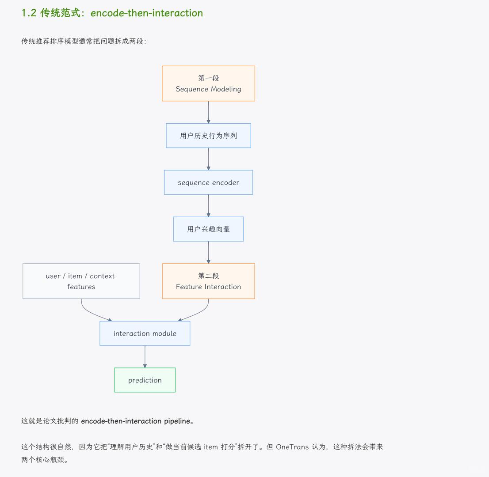

#### 1.2 传统范式：encode-then-interaction

传统推荐排序模型通常把问题拆成两段：

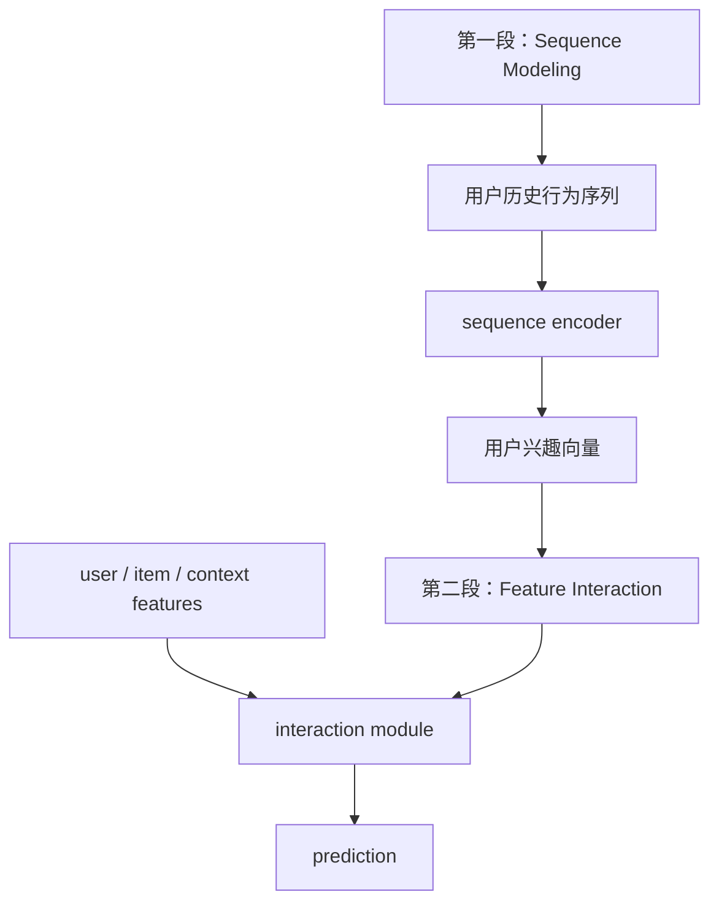
```mermaid
flowchart TD
  A["第一段：Sequence Modeling"] --> B["用户历史行为序列"]
  B --> C["sequence encoder"]
  C --> D["用户兴趣向量"]
  D --> E["第二段：Feature Interaction"]
  F["user / item / context features"] --> G["interaction module"]
  E --> G
  G --> H["prediction"]
```

这就是论文批判的 encode-then-interaction pipeline。

这个结构很自然，因为它把“理解用户历史”和“做当前候选 item 打分”拆开了。但 OneTrans 认为，这种拆法会带来两个核心瓶颈。

## 图片 05 转录

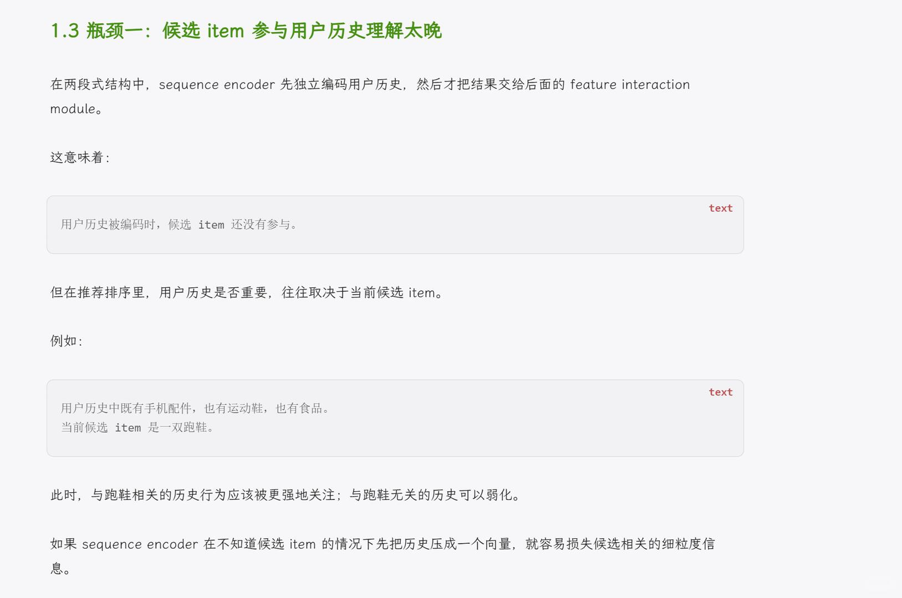

#### 1.3 瓶颈一：候选 item 参与用户历史理解太晚

在两段式结构中，sequence encoder 先独立编码用户历史，然后才把结果交给后面的 feature interaction module。

这意味着：

```text
用户历史被编码时，候选 item 还没有参与。
```

但在推荐排序里，用户历史是否重要，往往取决于当前候选 item。

例如：

```text
用户历史中既有手机配件，也有运动鞋，也有食品。
当前候选 item 是一双跑鞋。
```

此时，与跑鞋相关的历史行为应该被更强地关注；与跑鞋无关的历史可以弱化。

如果 sequence encoder 在不知道候选 item 的情况下先把历史压成一个向量，就容易损失候选相关的细粒度信息。

## 图片 06 转录

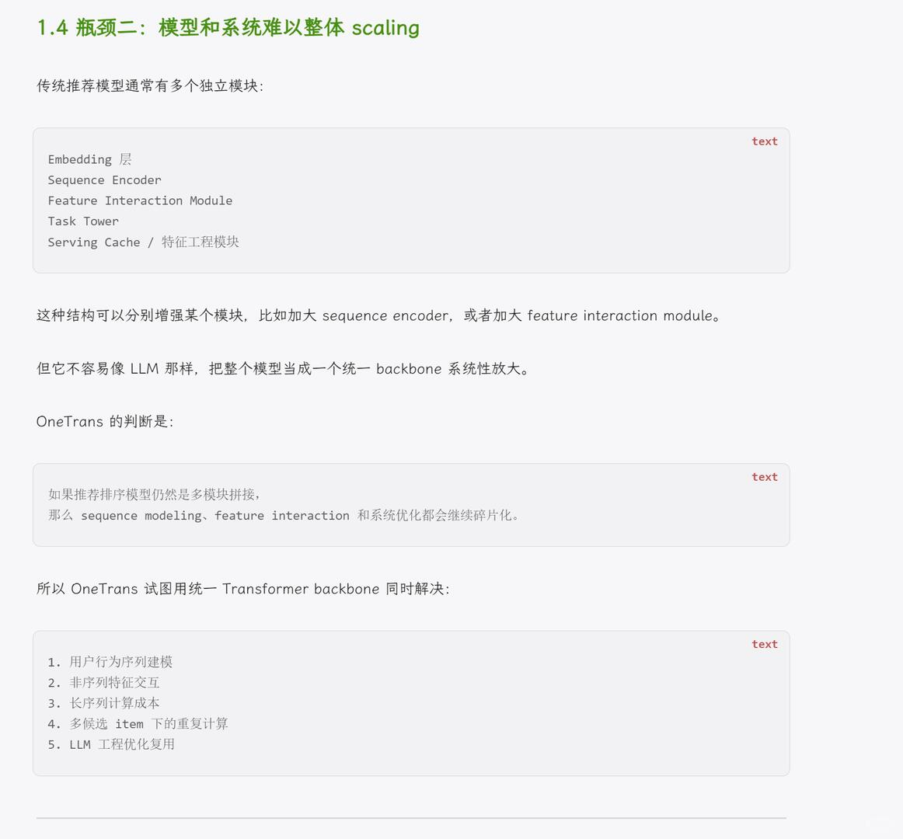

#### 1.4 瓶颈二：模型和系统难以整体 scaling

传统推荐模型通常有多个独立模块：

```text
Embedding 层
Sequence Encoder
Feature Interaction Module
Task Tower
Serving Cache / 特征工程模块
```

这种结构可以分别增强某个模块，比如加大 sequence encoder，或者加大 feature interaction module。

但它不容易像 LLM 那样，把整个模型当成一个统一 backbone 系统性放大。

OneTrans 的判断是：

```text
如果推荐排序模型仍然是多模块拼接，
那么 sequence modeling、feature interaction 和系统优化都会继续碎片化。
```

所以 OneTrans 试图用统一 Transformer backbone 同时解决：

```text
1. 用户行为序列建模
2. 非序列特征交互
3. 长序列计算成本
4. 多候选 item 下的重复计算
5. LLM 工程优化复用
```

## 图片 07 转录

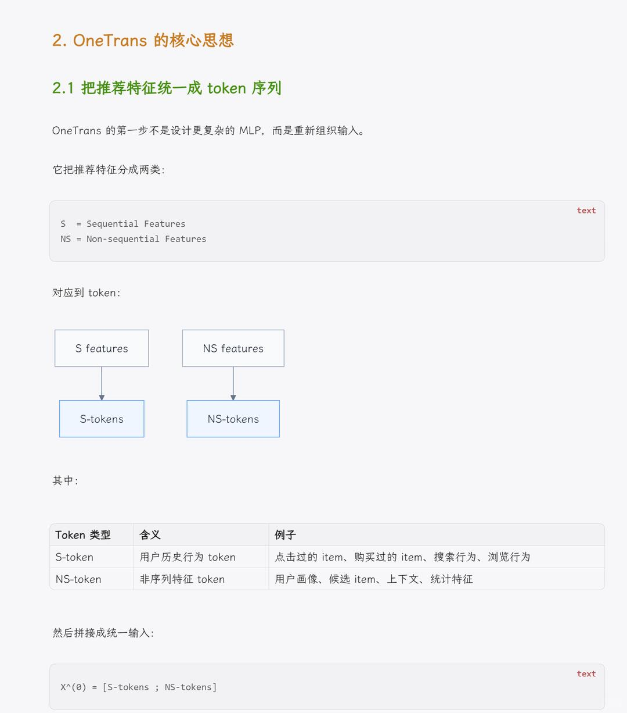

### 2. OneTrans 的核心思想

#### 2.1 把推荐特征统一成 token 序列

OneTrans 的第一步不是设计更复杂的 MLP，而是重新组织输入。

它把推荐特征分成两类：

```text
S  = Sequential Features
NS = Non-sequential Features
```

对应到 token：

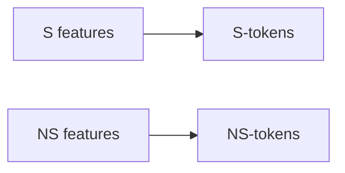
```mermaid
flowchart LR
  A["S features"] --> B["S-tokens"]
  C["NS features"] --> D["NS-tokens"]
```

其中：

| Token 类型 | 含义 | 例子 |
| --- | --- | --- |
| S-token | 用户历史行为 token | 点击过的 item、购买过的 item、搜索行为、浏览行为 |
| NS-token | 非序列特征 token | 用户画像、候选 item、上下文、统计特征 |

然后拼接成统一输入：

```text
X^(0) = [S-tokens ; NS-tokens]
```

## 图片 08 转录

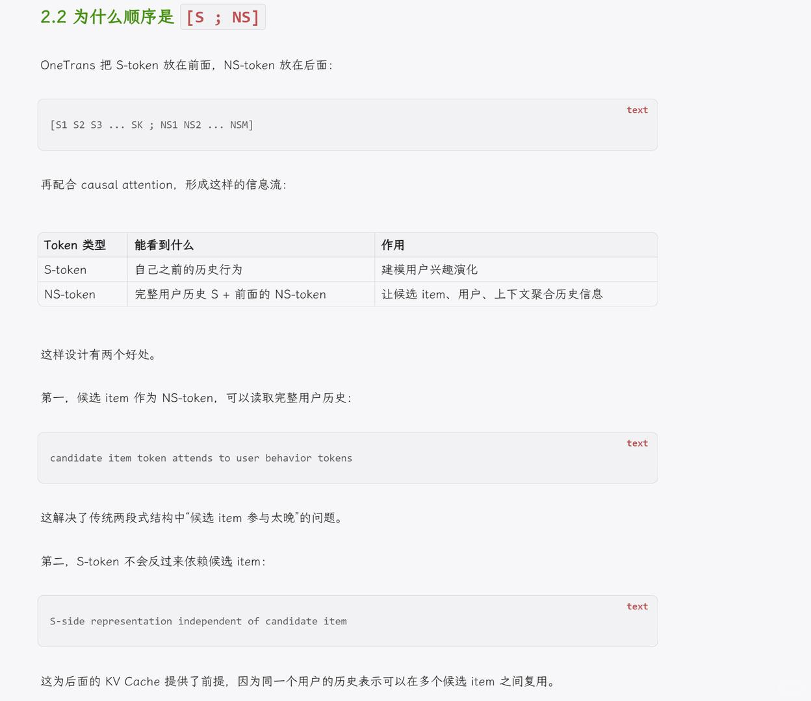

#### 2.2 为什么顺序是 `[S ; NS]`

OneTrans 把 S-token 放在前面，NS-token 放在后面：

```text
[S1 S2 S3 ... SK ; NS1 NS2 ... NSM]
```

再配合 causal attention，形成这样的信息流：

| Token 类型 | 能看到什么 | 作用 |
| --- | --- | --- |
| S-token | 自己之前的历史行为 | 建模用户兴趣演化 |
| NS-token | 完整用户历史 S + 前面的 NS-token | 让候选 item、用户、上下文聚合历史信息 |

这样设计有两个好处。

第一，候选 item 作为 NS-token，可以读取完整用户历史：

```text
candidate item token attends to user behavior tokens
```

这解决了传统两段式结构中“候选 item 参与太晚”的问题。

第二，S-token 不会反过来依赖候选 item：

```text
S-side representation independent of candidate item
```

这为后面的 KV Cache 提供了前提，因为同一个用户的历史表示可以在多个候选 item 之间复用。

## 图片 09 转录

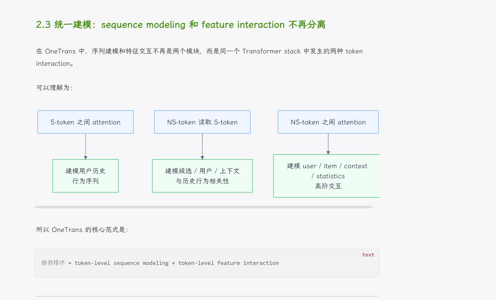

#### 2.3 统一建模：sequence modeling 和 feature interaction 不再分离

在 OneTrans 中，序列建模和特征交互不再是两个模块，而是同一个 Transformer stack 中发生的两种 token interaction。

可以理解为：

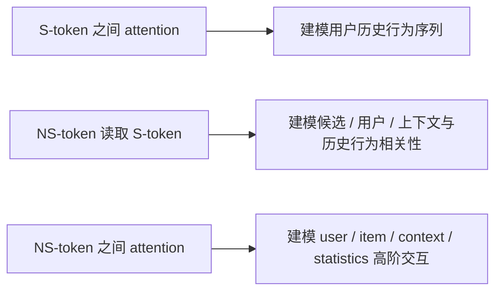
```mermaid
flowchart LR
  A["S-token 之间 attention"] --> B["建模用户历史行为序列"]
  C["NS-token 读取 S-token"] --> D["建模候选 / 用户 / 上下文与历史行为相关性"]
  E["NS-token 之间 attention"] --> F["建模 user / item / context / statistics 高阶交互"]
```

所以 OneTrans 的核心范式是：

```text
推荐排序 = token-level sequence modeling + token-level feature interaction
```

## 图片 10 转录

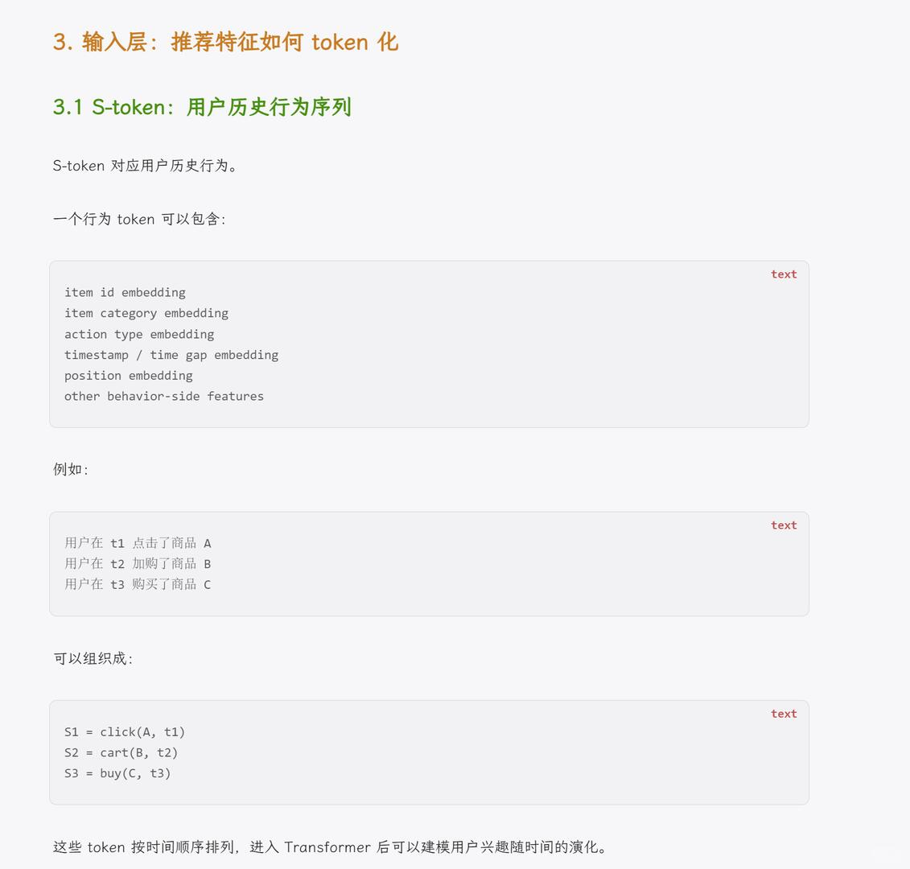

### 3. 输入层：推荐特征如何 token 化

#### 3.1 S-token：用户历史行为序列

S-token 对应用户历史行为。

一个行为 token 可以包含：

```text
item id embedding
item category embedding
action type embedding
timestamp / time gap embedding
position embedding
other behavior-side features
```

例如：

```text
用户在 t1 点击了商品 A
用户在 t2 加购了商品 B
用户在 t3 购买了商品 C
```

可以组织成：

```text
S1 = click(A, t1)
S2 = cart(B, t2)
S3 = buy(C, t3)
```

这些 token 按时间顺序排列，进入 Transformer 后可以建模用户兴趣随时间的演化。

## 图片 11 转录

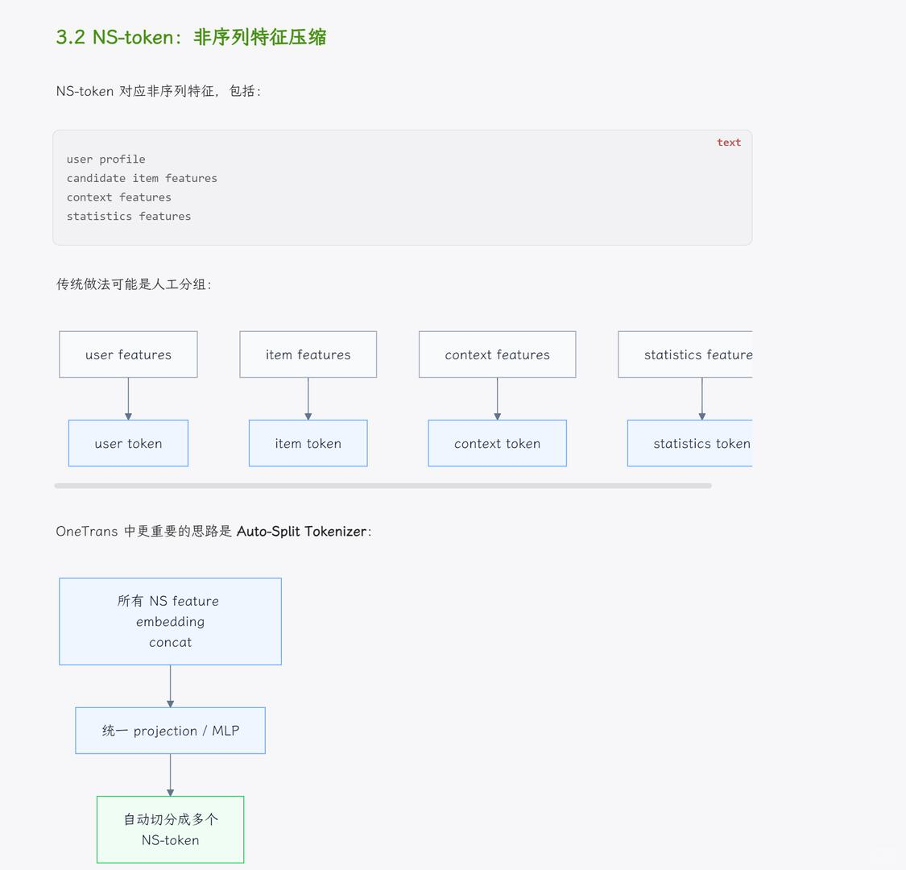

#### 3.2 NS-token：非序列特征压缩

NS-token 对应非序列特征，包括：

```text
user profile
candidate item features
context features
statistics features
```

传统做法可能是人工分组：

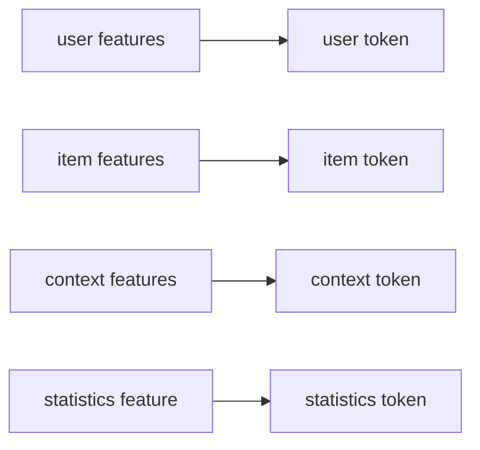
```mermaid
flowchart LR
  A["user features"] --> B["user token"]
  C["item features"] --> D["item token"]
  E["context features"] --> F["context token"]
  G["statistics feature"] --> H["statistics token"]
```

OneTrans 中更重要的思路是 Auto-Split Tokenizer：

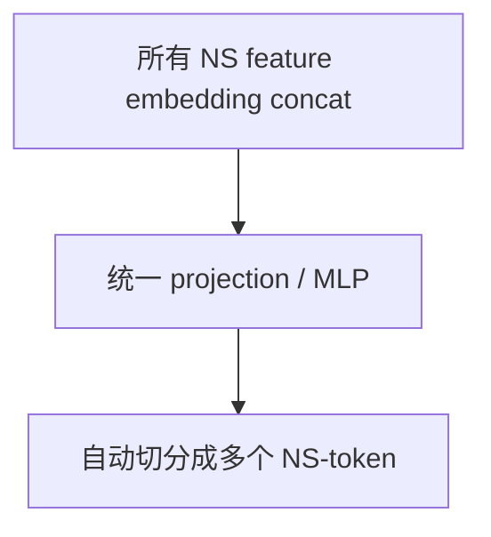
```mermaid
flowchart TD
  A["所有 NS feature embedding concat"] --> B["统一 projection / MLP"]
  B --> C["自动切分成多个 NS-token"]
```

## 图片 12 转录

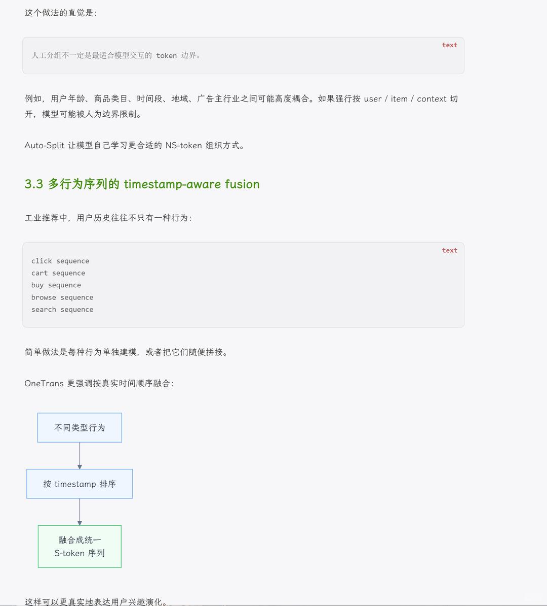

这个做法的直觉是：

```text
人工分组不一定是最适合模型交互的 token 边界。
```

例如，用户年龄、商品类目、时间段、地域、广告主行业之间可能高度耦合。如果强行按 user / item / context 切开，模型可能被人为边界限制。

Auto-Split 让模型自己学习更合适的 NS-token 组织方式。

#### 3.3 多行为序列的 timestamp-aware fusion

工业推荐中，用户历史往往不只有一种行为：

```text
click sequence
cart sequence
buy sequence
browse sequence
search sequence
```

简单做法是每种行为单独建模，或者把它们随便拼接。

OneTrans 更强调按真实时间顺序融合：

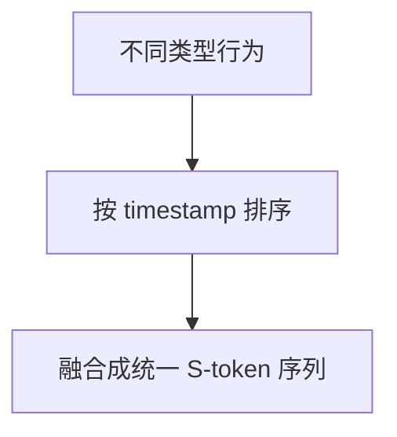
```mermaid
flowchart TD
  A["不同类型行为"] --> B["按 timestamp 排序"]
  B --> C["融合成统一 S-token 序列"]
```

这样可以更真实地表达用户兴趣演化。

## 图片 13 转录

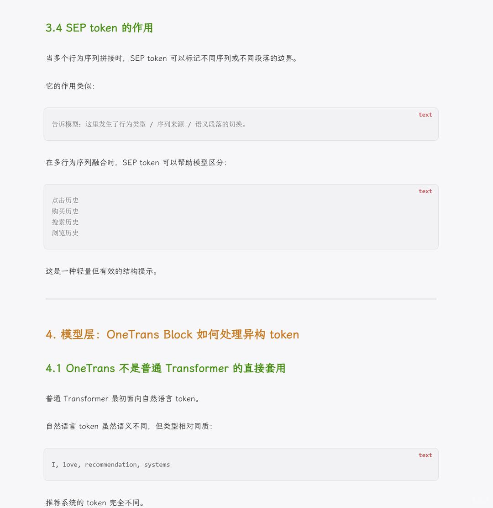

#### 3.4 SEP token 的作用

当多个行为序列拼接时，SEP token 可以标记不同序列或不同段落的边界。

它的作用类似：

```text
告诉模型：这里发生了行为类型 / 序列来源 / 语义段落的切换。
```

在多行为序列融合时，SEP token 可以帮助模型区分：

```text
点击历史
购买历史
搜索历史
浏览历史
```

这是一种轻量但有效的结构提示。

### 4. 模型层：OneTrans Block 如何处理异构 token

#### 4.1 OneTrans 不是普通 Transformer 的直接套用

普通 Transformer 最初面向自然语言 token。

自然语言 token 虽然语义不同，但类型相对同质：

```text
I, love, recommendation, systems
```

推荐系统的 token 完全不同。

## 图片 14 转录

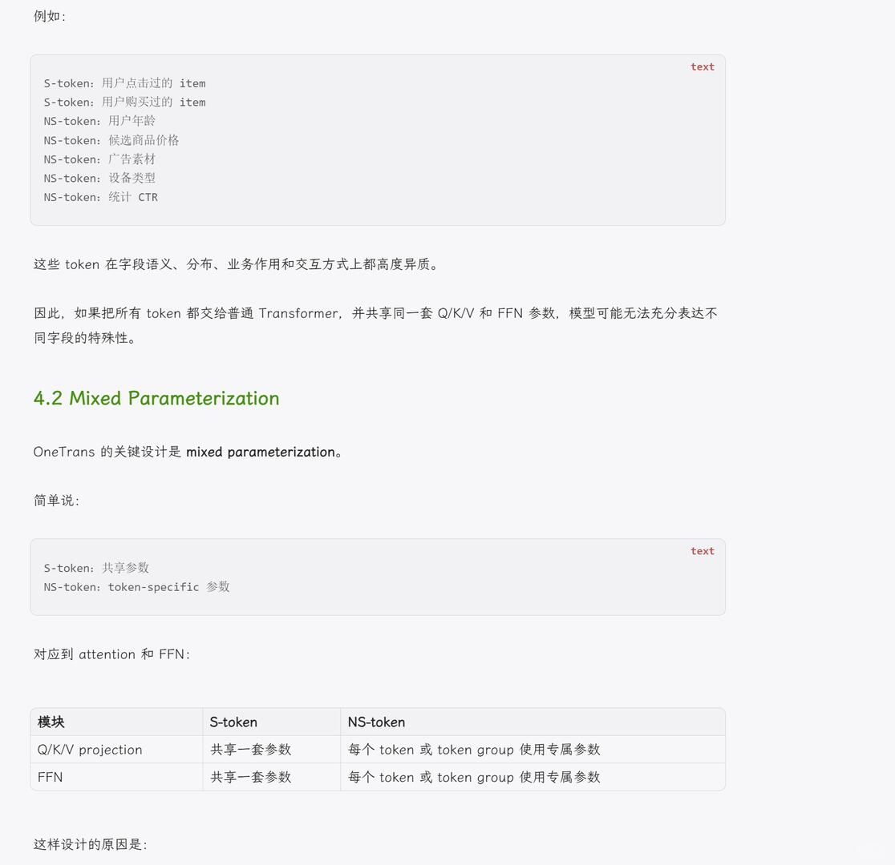

例如：

```text
S-token: 用户点击过的 item
S-token: 用户购买过的 item
NS-token: 用户年龄
NS-token: 候选商品价格
NS-token: 广告素材
NS-token: 设备类型
NS-token: 统计 CTR
```

这些 token 在字段语义、分布、业务作用和交互方式上都高度异质。

因此，如果把所有 token 都交给普通 Transformer，并共享同一套 Q/K/V 和 FFN 参数，模型可能无法充分表达不同字段的特殊性。

#### 4.2 Mixed Parameterization

OneTrans 的关键设计是 mixed parameterization。

简单说：

```text
S-token: 共享参数
NS-token: token-specific 参数
```

对应到 attention 和 FFN：

| 模块 | S-token | NS-token |
| --- | --- | --- |
| Q/K/V projection | 共享一套参数 | 每个 token 或 token group 使用专属参数 |
| FFN | 共享一套参数 | 每个 token 或 token group 使用专属参数 |

这样设计的原因是：

## 图片 15 转录

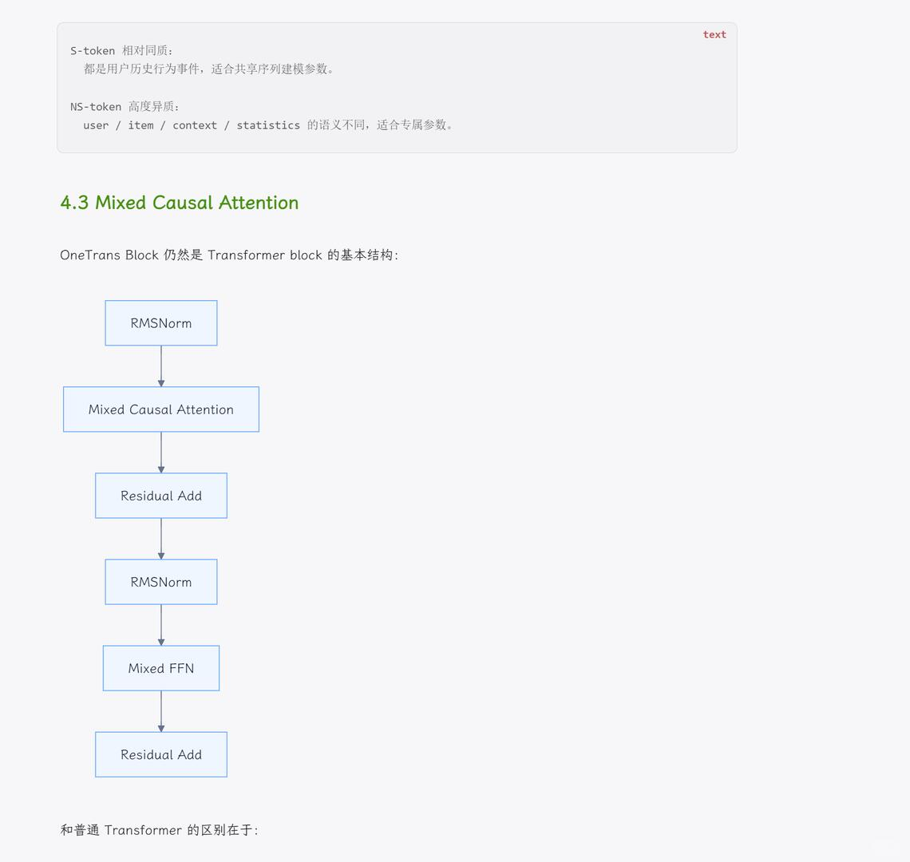

```text
S-token 相对同质：
  都是用户历史行为事件，适合共享序列建模参数。

NS-token 高度异质：
  user / item / context / statistics 的语义不同，适合专属参数。
```

#### 4.3 Mixed Causal Attention

OneTrans Block 仍然是 Transformer block 的基本结构：

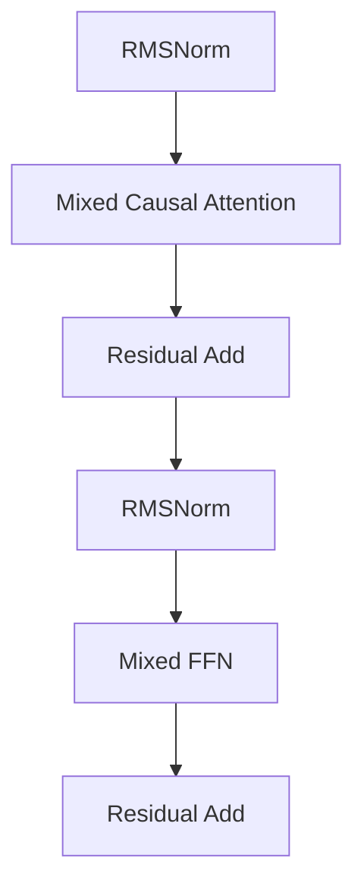
```mermaid
flowchart TD
  A["RMSNorm"] --> B["Mixed Causal Attention"]
  B --> C["Residual Add"]
  C --> D["RMSNorm"]
  D --> E["Mixed FFN"]
  E --> F["Residual Add"]
```

和普通 Transformer 的区别在于：

## 图片 16 转录

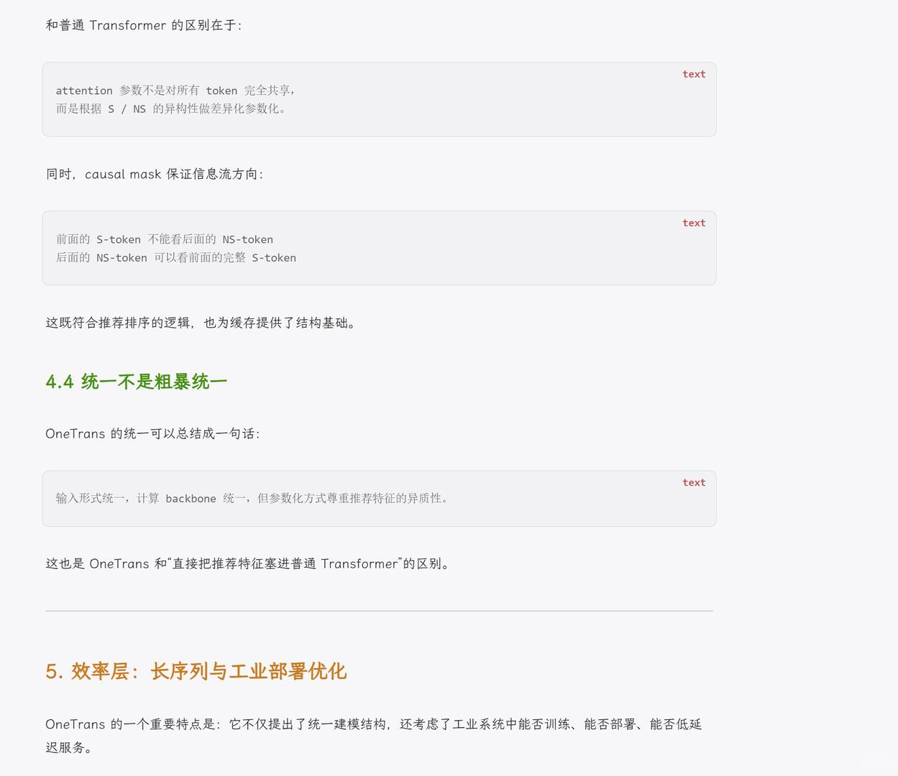

和普通 Transformer 的区别在于：

```text
attention 参数不是对所有 token 完全共享，
而是根据 S / NS 的异构性做差异化参数化。
```

同时，causal mask 保证信息流方向：

```text
前面的 S-token 不能看后面的 NS-token
后面的 NS-token 可以看前面的完整 S-token
```

这既符合推荐排序的逻辑，也为缓存提供了结构基础。

#### 4.4 统一不是粗暴统一

OneTrans 的统一可以总结成一句话：

```text
输入形式统一，计算 backbone 统一，但参数化方式尊重推荐特征的异质性。
```

这也是 OneTrans 和“直接把推荐特征塞进普通 Transformer”的区别。

### 5. 效率层：长序列与工业部署优化

OneTrans 的一个重要特点是：它不仅提出了统一建模结构，还考虑了工业系统中能否训练、能否部署、能否低延迟服务。

## 图片 17 转录

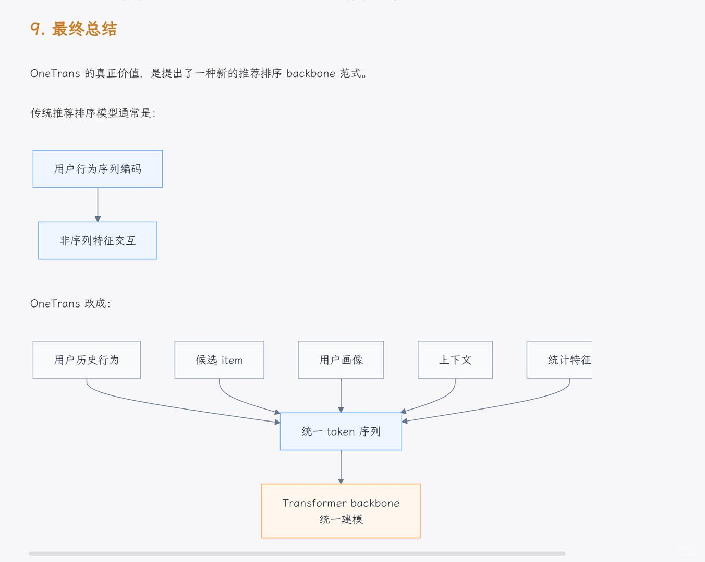

### 9. 最终总结

OneTrans 的真正价值，是提出了一种新的推荐排序 backbone 范式。

传统推荐排序模型通常是：

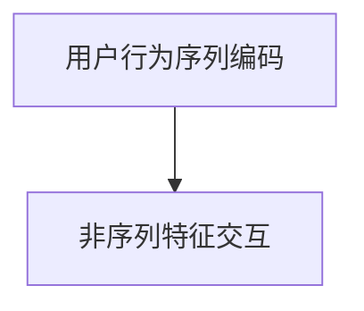
```mermaid
flowchart TD
  A["用户行为序列编码"] --> B["非序列特征交互"]
```

OneTrans 改成：

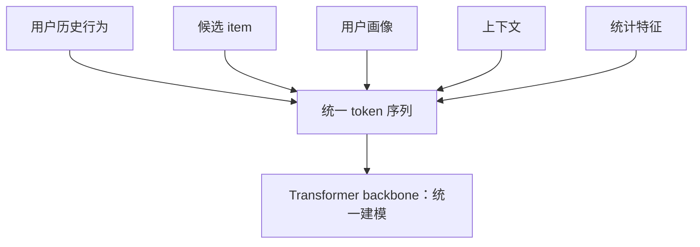
```mermaid
flowchart TD
  A["用户历史行为"] --> F["统一 token 序列"]
  B["候选 item"] --> F
  C["用户画像"] --> F
  D["上下文"] --> F
  E["统计特征"] --> F
  F --> G["Transformer backbone：统一建模"]
```

## 图片 18 转录

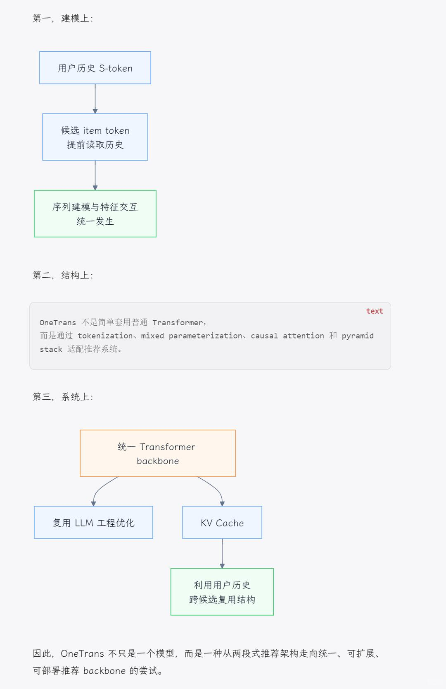

第一，建模上：

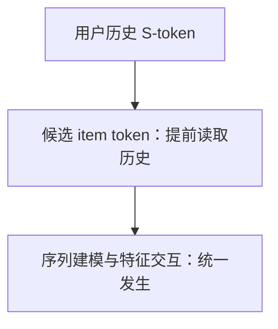
```mermaid
flowchart TD
  A["用户历史 S-token"] --> B["候选 item token：提前读取历史"]
  B --> C["序列建模与特征交互：统一发生"]
```

第二，结构上：

```text
OneTrans 不是简单套用普通 Transformer，
而是通过 tokenization、mixed parameterization、causal attention 和 pyramid stack 适配推荐系统。
```

第三，系统上：

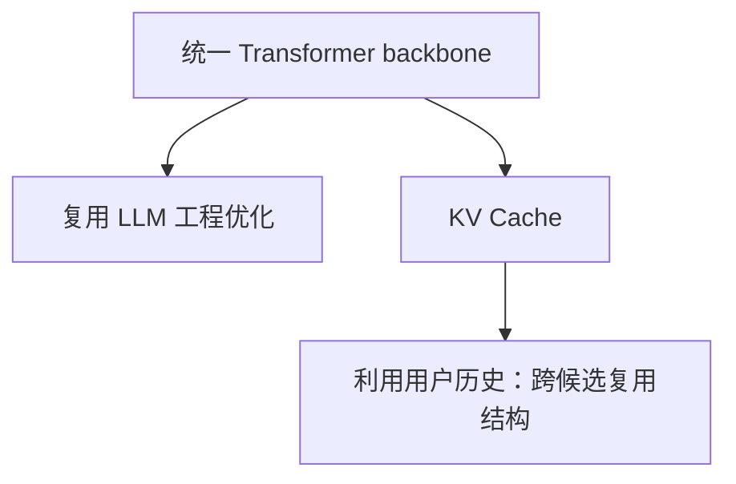
```mermaid
flowchart TD
  A["统一 Transformer backbone"] --> B["复用 LLM 工程优化"]
  A --> C["KV Cache"]
  C --> D["利用用户历史：跨候选复用结构"]
```

因此，OneTrans 不只是一个模型，而是一种从两段式推荐架构走向统一、可扩展、可部署推荐 backbone 的尝试。
